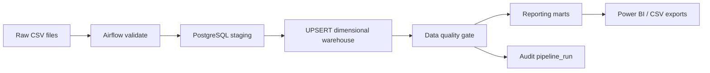

# Insurance Transaction Analytics — Airflow + PostgreSQL + Power BI
## Business questions
- How much premium is successfully collected each month?
- Which products have the highest loss ratio?
- Where are payment failures concentrated?
- Which channels are slow or unreliable?
- How quickly are claims settled?
- Which states/products have the largest fraud exposure?
- What is the renewal rate by product and segment?

## Architecture



## Technology
- Apache Airflow 3.3.0
- Python 3.12
- PostgreSQL 16
- Docker Compose
- Windows + WSL2 / Docker Desktop
- Power BI Desktop
- Pytest

## Repository structure

```text
insurance_transaction_analytics/
├── dags/
│   └── insurance_transaction_analytics_dag.py
├── src/
│   ├── db.py
│   ├── data_quality.py
│   └── pipeline.py
├── sql/
│   ├── 00_create_schemas.sql
│   ├── 01_create_staging.sql
│   ├── 02_create_warehouse.sql
│   ├── 03_upsert_dimensions.sql
│   ├── 04_upsert_facts.sql
│   ├── 05_marts.sql
│   ├── 06_analysis_queries.sql
│   └── docker_postgres_init.sql
├── data/
│   ├── raw/
│   └── processed/powerbi/
├── powerbi/
│   ├── measures.dax
│   └── POWER_BI_GUIDE.md
├── tests/
│   └── test_data_quality.py
├── screenshots/
│   └── insurance_powerbi_dashboard_preview.png
├── docs/
│   └── DATA_DICTIONARY.md
├── Dockerfile
├── docker-compose.yml
├── SETUP_WINDOWS.md
└── PROJECT_SUMMARY.md
```

## Pipeline DAG
`validate -> initialize DB -> staging load -> warehouse UPSERT -> data quality -> Power BI export -> audit`

The staging load is intentionally replace-based and the warehouse is UPSERT-based, which makes task retries safe
for this portfolio pipeline.


## PostgreSQL schemas
- `staging`: source-shaped tables
- `warehouse`: dimensions and facts
- `mart`: BI reporting views
- `audit`: pipeline execution evidence

## Data model
- `dim_customer`
- `dim_agent`
- `dim_policy`
- `fact_transaction`
- `fact_claim`

## Dataset scale
| Entity | Rows |
|---|---:|
| Customers | 6,000 |
| Agents | 80 |
| Policies | 9,000 |
| Transactions | 75,000 |
| Claims | 12,000 |

## Key KPI snapshot
| KPI | Value |
|---|---:|
| Premium collected | RM 44,363,262 |
| Approved claim amount | RM 29,024,314 |
| Loss ratio | 65.4% |
| Transaction success rate | 93.3% |
| Active policies | 2,084 |
| Renewal rate | 53.7% |
| Avg claim settlement | 13.4 days |
| Fraud flagged claims | 381 |

## Power BI

Dax measure :
- KPI cards: Premium, Approved Claims, Loss Ratio, Success Rate, Active Policies, Renewal Rate
- Monthly premium vs claims trend
- Loss ratio by product
- Success rate by channel
- Claim status distribution
- Fraud exposure by state

## Data quality controls
The Airflow quality task fails the DAG if it detects:
- null/duplicate transaction keys;
- null claim keys;
- invalid status values;
- negative claim values;
- fraud scores outside 0-100;
- orphan fact-to-policy relationships;
- empty critical warehouse tables.

## Testing
With local Python dependencies installed:

## Security / production hardening
This repository is intentionally local-development friendly. Before production:
- remove plaintext local credentials;
- use a secrets manager;
- deploy on a supported Linux/Kubernetes environment;
- externalize logs;
- enable SSO/RBAC;
- add encrypted network connections, backups, vulnerability scanning and CI/CD.

## Power bi Dashboard image
See [powerbi/screenshots/insurance_powerbi_dashboard_preview.png].

## Author
Revathy Shanmugaraj
